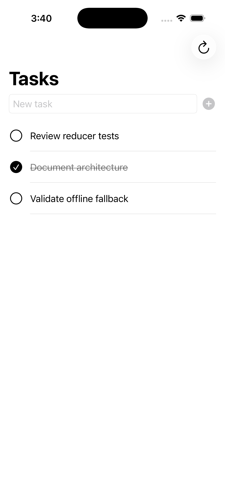
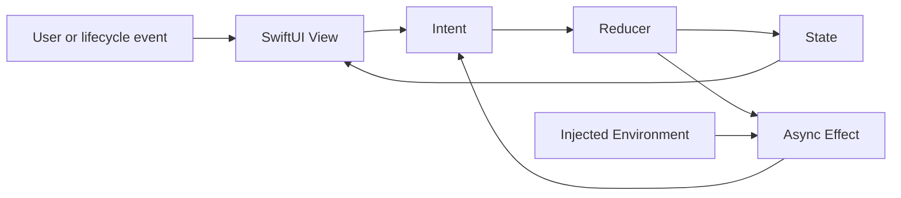

# MVITaskFlow

A SwiftUI MVI reference app demonstrating reducer-driven state, async effects, dependency injection, and testable unidirectional architecture.

> Portfolio note: this is an intentionally small architecture reference, not a production task manager.

## Why This Project Exists

SwiftUI makes simple state management easy, but feature behavior becomes harder to reason about once async loading, optimistic updates, failures, and persistence enter the same screen. This project isolates those concerns behind explicit intents, pure state transitions, and injected effect dependencies.

The goal is to make behavior observable and testable without tying the feature to a specific networking or persistence framework.

## Demo

<p align="center">
  
</p>

## Architecture



Each feature owns:

- `TaskState`: the complete renderable state.
- `TaskIntent`: user, lifecycle, and effect-result events.
- `Environment`: injected fetch, save, and delete operations.
- `reducer(env:)`: synchronous state transitions and effect creation.

The reusable runtime contains:

- `Store<State, Intent>` for state ownership and intent dispatch.
- `Reducer<State, Intent>` for deterministic transitions.
- `Effect<Intent>` for async work that returns a follow-up intent.

## Project Structure

```text
MVITaskFlow/
├── Core/MVI/
│   ├── Store.swift
│   ├── Reducer.swift
│   └── Effect.swift
├── Features/Tasks/
│   ├── Data/
│   │   ├── TaskRepository.swift
│   │   ├── TaskAPIClient.swift
│   │   ├── LiveTaskRepository.swift
│   │   ├── MockTaskRepository.swift
│   │   ├── TaskCache.swift
│   │   └── AppTaskEnvironment.swift
│   ├── Domain/TaskItem.swift
│   └── Presentation/
│       ├── TasksFeature.swift
│       └── TasksView.swift
├── MVITaskFlowTests/
└── MVITaskFlowUITests/
```

## Testing Strategy

- Reducer tests verify draft updates, optimistic insertion, completion toggling, deletion, and loading state.
- Effect tests inject deterministic dependencies and verify success and failure intents.
- Data-layer tests cover the offline cache and mock repository behavior.
- UI tests cover populated, empty, and error launch scenarios with deterministic arguments.
- CI runs SwiftLint, SwiftFormat validation, and the Xcode test plan on an iOS simulator.

## Production Tradeoffs

This reference keeps the architecture visible by avoiding infrastructure that would distract from the state flow. A production implementation should additionally consider:

- durable persistence and conflict resolution;
- cancellation and effect identity;
- rollback for failed optimistic mutations;
- pagination, telemetry, and accessibility auditing;
- feature modularization when multiple domains share the runtime;
- deterministic UI-test fixtures and broader failure-path coverage.

## MVI vs MVVM Tradeoffs in SwiftUI

MVI makes state transitions explicit: every change enters as an intent and passes through one reducer. That improves replayability, debugging, and reducer-level testing, especially when a feature has several async states. The cost is additional types and routing for interactions that would be direct method calls in a small MVVM screen.

MVVM often fits SwiftUI naturally because an observable ViewModel can expose state and imperative actions with less ceremony. As the ViewModel grows, however, state can be mutated from many methods and async paths, making transitions harder to audit. This project uses MVI to demonstrate the stricter boundary; it does not claim MVI is universally preferable.

## Data Modes and Offline Behavior

- The default launch uses a deterministic in-memory mock repository.
- Add the `--live-data` launch argument to fetch JSONPlaceholder tasks.
- Successful live responses are cached as JSON in the app cache directory.
- If a later live request fails, the repository returns cached tasks when available.
- UI-test launch arguments provide deterministic populated, empty, and error states.

The live API is a public test service, so writes are illustrative rather than durable server persistence.

## How to Run

Requirements: Xcode 16 or newer and an installed iOS Simulator runtime.

```bash
git clone https://github.com/niravjain02/MVITaskFlow.git
cd MVITaskFlow
open MVITaskFlow.xcodeproj
```

Select the `MVITaskFlow` scheme and run on an iPhone simulator.

Run tests from the command line:

```bash
xcodebuild test \
  -project MVITaskFlow.xcodeproj \
  -scheme MVITaskFlow \
  -destination 'platform=iOS Simulator,OS=latest,name=iPhone 16 Pro'
```

If that simulator name is not installed locally, replace it with any available iPhone simulator from `xcrun simctl list devices available`.

## Code Quality

```bash
brew install swiftlint swiftformat
swiftlint lint --strict
swiftformat --lint .
```

GitHub Actions runs the same checks for pushes and pull requests.

The Xcode project uses Swift 6 language mode, complete strict-concurrency checking, and explicit `Sendable` boundaries around state, intents, effects, and repositories.

## License

Released under the MIT License. See [LICENSE](LICENSE).
